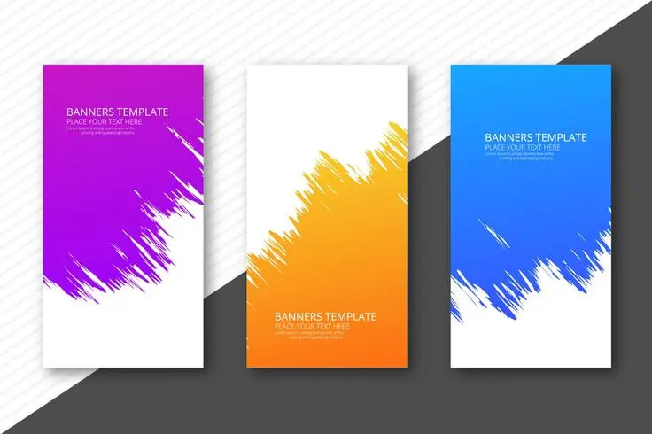

  <h1>🚀 The Dev's Toolkit</h1>
  
Un espace personnel pour organiser et visualiser mes snippets de code, palettes de couleurs, polices, et SVGs.

  
  

    
    
    
    
  

  
  

    <a href="./index.html">Voir la démo</a> •
    <a href="#-présentation-rapide">Présentation projet</a> •
    <a href="#-ce-que-jai-appris">Ce que j'ai appris</a> •
    <a href="#-à-propos-de-lautrice">À propos</a>
  

  
  <!-- TODO Modifier le chemin de l'ancre -->
  

## 🧩 Présentation rapide

The Dev's Toolkit est un projet inspiré de CodePen, conçu pour centraliser et organiser mes ressources de développement (snippets de code, palettes de couleurs, polices, et SVGs). Ce projet me sert également de terrain d’apprentissage pour JavaScript, en explorant la manipulation de données JSON, la création d’interfaces dynamiques, et les bonnes pratiques de développement front-end.

🔗 [Voir la démo dans le navigateur](./index.html)

## 🖼️ Aperçu

<!-- TODO Modifier le chemin de l'ancre -->

## 🔧 Technologies utilisées

- HTML/CSS : Structure et style de l’interface.
- JavaScript : Logique dynamique pour charger et manipuler les données.
- JSON : Stockage des données (snippets, couleurs, polices, SVGs).

## ✅ Ce que j’ai appris

- [ ] Apprendre à manipuler des fichiers JSON en JavaScript.
- [ ] Créer une interface utilisateur dynamique et réactive.
- [ ] Comprendre les bonnes pratiques de structuration de projet.

## 🛠️ À améliorer plus tard

- 📱 Créer des onglets dans la modale pour mieux voir les blocs de code
- 💡 Mieux structurer mes projets

## 👩‍💻 À propos de l’autrice

> Code, café, et curiosité technique ☕💡  
> Retrouve-moi ici → [github.com/jhauck67](https://github.com/jhauck67)

  <em>Merci d’avoir visité ce dépôt ! 
  🚂 En route vers de nouveaux projets web… 🚦</em>

  
<strong>jhauck67</strong> 
  Apprentie développeuse web

  

    <a href="https://github.com/jhauck67">GitHub</a> •
    <a href="https://jhauck67.github.io/jhauck67/">Portfolio</a> •
    <a href="https://codepen.io/jhauck67">Codepen.io</a>
  

